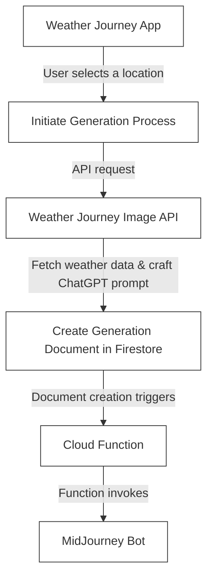

# MidJourney Cloud Function

This is a Google Cloud Function used to access the MidJourney Discord channel on my Discord Server and query the MidJourney bot to generate stuff. This function is triggered when a new document (generation) is created.

## How it works

